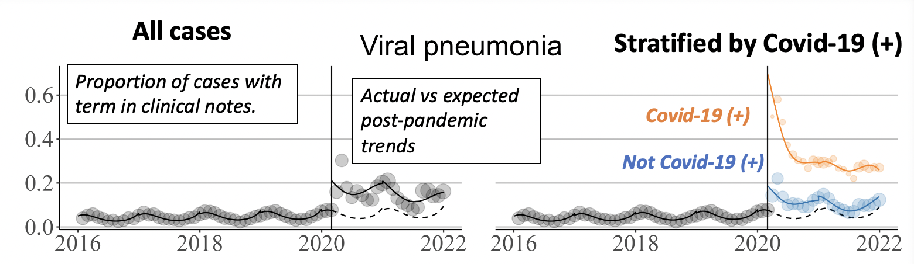
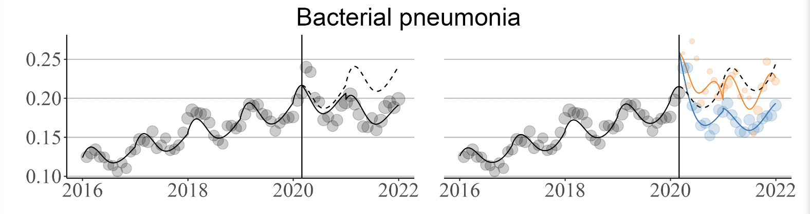
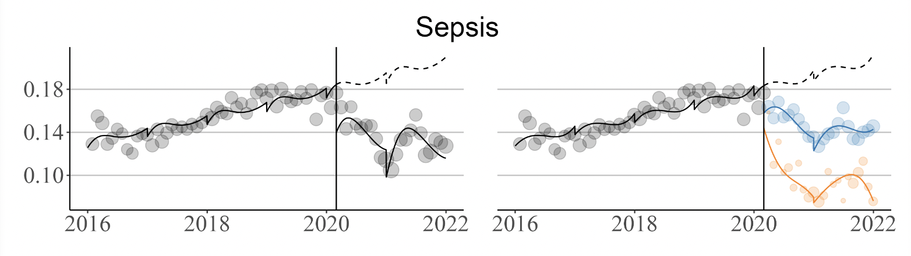
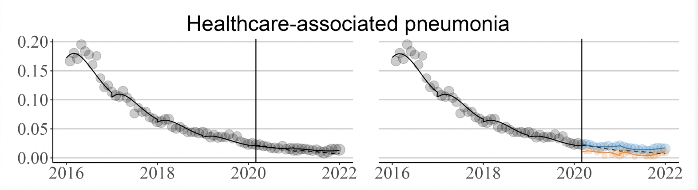

# A linguistic analysis examining the impact of COVID-19 on pneumonia diagnosis and disease models

This work was presented as a poster at MedInfo 2023 in Sydney, Australia.

_Authors_: Alec Chapman, Kelly Peterson, Elizabeth Rutter, McKenna Nevers, Jian Ying,
David Classen, Makoto Jones, Matthew Samore, and Barbara Jones

*Affiliations*: University of Utah School of Medicine and the US Department of Veterans Affairs Salt Lake City Healthcare System

Poster: [./Alec_Chapman_PneumoniaLinguisticTrends.pdf](./Alec_Chapman_PneumoniaLinguisticTrends.pdf)

## Abstract
_Written clinical language embodies and reflects the clinician’s mental models of disease. 
Prior to the COVID-19 pandemic, pneumonia was shifting away from concern for healthcare-associated pneumonia and toward 
recognition of heterogeneity of pathogens and host response. 
How these models are reflected in clinical language or whether they were impacted by the pandemic has not been studied. 
We aimed to assess changes in the language used to describe pneumonia following the COVID-19 pandemic._

## Background
The way clinicians think about and treat diseases such as pneumonia changes over time. These changes 
can occur due to a number of factors, including:
- The underlying pathology of the disease (e.g., what viruses are prevalent among the population)
- Systematic changes in the treatment of a disease (e.g., changes in clinical guidelines or quality initiatives)
- Improved biologic understanding of how a disease arises

The Covid-19 pandemic was a large systematic shock to the way clinicians treat and think about pneumonia. 
However, prior to the COVID-19 pandemic, the clinical conceptualization of pneumonia was already shifting 
away from concern for healthcare-associated pneumonia (“HCAP”) 
and toward recognition of heterogeneity of pathogens (bacterial vs. viral) and host response. 

Written clinical language embodies and reflects the clinician’s mental models of disease. 
Thus, clinical notes for pneumonia positive patients may provide clues as to the prevailing conceptual model 
of pneumonia. 

The objective of this analysis was to:
1) Examine temporal changes in pneumonia documentation that may reflect changes in pneumonia conceptual models; and 
2) Explore the extent to which these changes were driven by the Covid-19 pandemic or pre-existing trends

## Methods
### Data
We used a previously validated NLP system ([Chapman et al, 2023](https://academic.oup.com/jamiaopen/article/5/4/ooac114/6965695)) 
and ICD-10 codes to identify to identify 314k pneumonia-positive hospitalizations in the U.S. Department of Veterans Affairs 
between January 1st, 2016 and December 31st, 2021. For each hospitalization, we processed emergency department notes, radiology 
reports, and discharge summaries and extracted the following pneumonia-related concepts:
- **"Viral pneumonia"**
- **"Bacterial pneumonia"**
- **"Sepsis"**
- **"Healthcare-associated pneumonia"**

We aggregated to a hospitalization level by creating indicator variables indicating whether a concept was present 
in at least one note. 

### Temporal Model
Our objective was to study trends in documentation over calendar time, pre- and post-pandemic, and by Covid-19 status.
To do this, we modeled the probability that a hospitalization would have a note with a term using a segmented logistic regression model.

#### Model 1

For each term, let $Y_{i}$ be 1 if a hospitalization _i_ occurring at time $t_i$ contains that term. Then we can model
the probability of a hospitalization containing that term as:
$$logit(P[Y_{it} = 1]) = \beta_0 + \beta_1 t_i + \beta_2 \mathbf{F(t_i)} + \beta_3 A_{t_i} + \beta_4 (A_{t_i} \times t_i)  + \beta_5 (A_{t_i} \times F(t_i))$$

where:
- $t_i$ represents the number of days January 1st, 2016 and the hospitalization discharge 
- $\mathbf{F(t_i)}$ is a polynomial spline on the day of the year
- $A_{t_i}$ is an indicator variable for whether the hospitalization occurred before or after March 1st, 2020

Intuitively, $\beta_1$ captures an overall temporal trend in documentation between 2016 and 2021. We would expect this to capture non-pandemic-related changes in documentation patterns. $\beta_2$ should allow us to model possible seasonal trends. $\beta_3$ should capture the immediate shift in documentation caused by the pandemic, while the remaining coefficients should capture the interactions between the pandemic and time.

#### Model 2
We might also be interested in whether changes in term prevalence occur only in Covid-19 positive patients or whether it is a more general change observed in all pneumonia patients. To do this, will add additional terms to our model: $\beta_6 C_i + \beta_7(C_i \times t_i) + \beta_8 (C_i \times F(t_i))$, where $C_i$ is an indicator for whether the patient was Covid (+) during their hospitalization.

### Trend analysis
After fitting our models, we obtain the expected probability by predicting the probability of each term over time. To compare pre- and post-pandemic trends, we obtain a counterfactual prediction by setting $A_i$ and/or $C_i$ to 0 for each post-pandemic hospitalization. To compare general secular trends we can compare this counterfactual probability with the observed probabilities in 2016.

## Results
We'll step through each term individually and interpret the results.
### Viral pneumonia
The figure below shows the model results among all cases (left) and stratified by Covid-19 status (right). Circles represent 
the observed proportion of hospitalizations with a term each month. Solid lines show the mean probabilities predicted by the model, 
while dashed lines show the counterfactual predictions based on pre-pandemic trends. On the right column, colors represent the 
Covid-19 diagnosis status.

We can see that prior to Covid-19, viral pneumonia showed a steady prevalence with some seasonality. 
After the onset of the pandemic, there was an immediate increase in the prevalence of viral pneumonia. When stratifying by 
Covid-19 status, the prevalence is much higher among Covid-19 positive patients, but among Covid-19 negative
patients the probability is also higher than what would be expected if pre-pandemic trends had continued.

### Bacterial pneumonia
In contrast to viral pneumonia, the prevalence of bacterial pneumonia appeared to be increasing between 2016 and 2020 and 
then decreased after the onset of the pandemic. When stratifying by Covid-19 status, we see that
there is a similar prevalence among Covid (+) patients as would have been expected based on
pre-pandemic trends, with the decrease largely being driven by Covid (-) patients.

### Sepsis
Similar to bacterial pneumonia, "sepsis" was steadily increasing between 2016 and 2020. There is
then a sharp decrease after March 2020. This decrease appears among both Covid (+) and Covid (-) patients, but is much
more pronounced among Covid (+) patients.

### Healthcare-associated pneumonia (HCAP)
"HCAP" was quite prevalent in 2017 and 2017 and then began to steadily decrease leading up to 2020.
By the onset of the pandemic, the prevalence was quite low. This trend continued after the pandemic, without any significant
difference among Covid (+) or (-) patients.

## Discussion
The increased documentation of **"viral"** and **"bacterial pneumonia"** could represent an increased recognition 
of the important distinction of pathogens. The increased prevalence of "viral pneumonia" is after March 2020 is of course
partly due to the high prevalence and attention paid to viral infections due to Covid-19, but the increased prevalence of "viral pneumonia" among
Covid-19 negative patients and "bacterial pneumonia" before Covid-19 and among Covid-19 positive patients could also suggest a general recognition of the importance of distinguishing between the two. 
Future work could also look at how this trend corresponds to changes in treatment (e.g., antibiotic administration).

**"Sepsis"** demonstrated a sharp decrease in prevalence after the onset of the pandemic. This could reflect the hazy, non-specific nature of sepsis,
which may be used as a "catch all" for pneumonia-related complications. With the onset of Covid-19, the diagnostic focus may have turned to Covid-19 instead.

Quality initiatives for pneumonia have gradually shifted away from a strong focus on preventing healthcare-associated pneumonia. 
This is reflected in the long downward trend of **"hcap"**, which was highly prevalent in 2016, but decreased steadily over time and had very 
low prevalence leading up to (and after) March 2020.

## Conclusion
Pneumonia prevalence was stable prior to and then increased during the pandemic. 
Language used to describe pneumonia diagnosis in clinical notes demonstrated a decline in HCAP, increased uncertainty,
distinguishing bacterial from viral pneumonia, and increased characterizations of the host inflammatory response. 
Clinical text can provide insight into shifting mental models of disease, which may explain changes and variation in clinical behavior. 
Future work is needed to understand how language and behavior influence each other in different settings and whether 
the pandemic will have lasting impacts on our models of respiratory infection.
